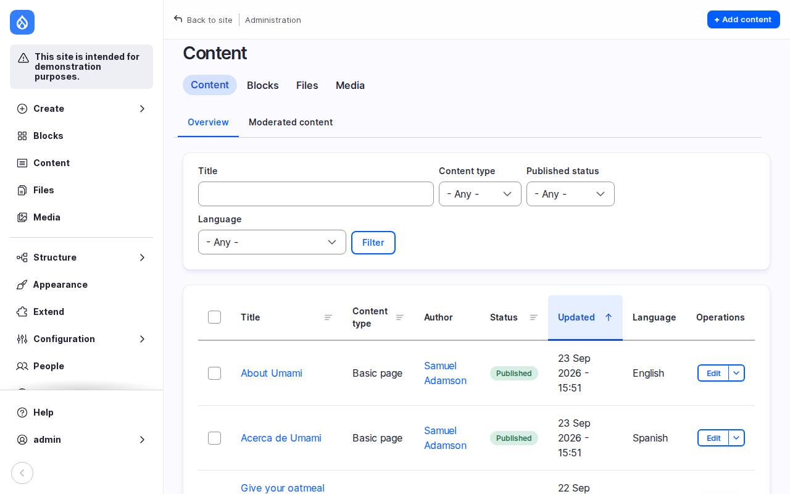

# Running this DDEV project in Claude Code on the web

This guide sets up a [Claude Code on the web](https://code.claude.com/docs/en/claude-code-on-the-web)
cloud environment in which Claude can run this Drupal 11 DDEV project
(`ddev start`, `ddev drush`, `ddev composer`) and check its work against the
running site.

The site is reachable **only from inside the cloud container**. Nothing can
connect in, and `ddev share` doesn't work (see [What doesn't work](#what-doesnt-work)).
So the practical ways to look at the site are:

- **curl** from the session, for status codes, headers, HTML, and APIs.
- **Playwright** (Chromium is preinstalled), for screenshots and logged-in
  browser flows. Claude can show you the screenshots.


## 1. Create the environment

In Claude Code on the web, create (or edit) an environment for this repository:

1. **Network access: Full.** DDEV has to download images, Composer packages,
   and so on. "Full" means any host, but **only on ports 80 and 443**; every
   other port times out.
2. **Setup script:** paste the script in [section 2](#2-setup-script).
3. **Environment variables:** none are required.

Start a new session afterwards; the setup script runs once when the container
is created, before Claude starts.

### Why a setup script is needed

- The session runs as **root**, and DDEV refuses to run as root. The script
  installs DDEV, adds the `ubuntu` user (uid 1000) to the `docker` group, and
  installs a `/usr/local/bin/ddev` wrapper that re-runs any `ddev` command as
  `ubuntu` in the current directory. Claude (and you) just type `ddev ...`.
- Docker isn't running by default. The script starts `dockerd` and waits for
  it to answer.
- All outbound HTTPS from the containers passes through the sandbox's
  **TLS-inspecting egress gateway**, which re-signs certificates with its own
  CA. Without that CA, every download inside the DDEV containers fails with
  `self-signed certificate in certificate chain`. The script adds the CA to
  DDEV's **global** build config (`~/.ddev/{web,db}-build/pre.Dockerfile.ccr-ca`),
  so nothing sandbox-specific is committed to the project.

## 2. Setup script

It logs every step to `/tmp/setup-script.log`. A failed required step makes
the script exit 1 with `ERROR: required setup step failed: <step>`, so session
startup reports the real problem. Optional steps only print a warning.

```bash
#!/bin/bash
# Claude Code cloud environment setup for the d11 DDEV project.
#
# Every step is logged to /tmp/setup-script.log. Required steps make the script
# exit non-zero with a summary naming the failed step, so session startup
# reports the real problem. Optional steps only print a warning.

exec > >(tee -a /tmp/setup-script.log) 2>&1
set -uo pipefail

PROJECT=/workspace/d11
REQUIRED_FAILED=()
OPTIONAL_FAILED=()

# run_step required|optional "name" function
run_step() {
  local kind=$1 name=$2 fn=$3 rc
  echo "==> [$kind] $name"
  "$fn"
  rc=$?
  if [ "$rc" -eq 0 ]; then
    echo "<== ok: $name"
  else
    echo "!!! FAILED (exit $rc): $name"
    if [ "$kind" = required ]; then
      REQUIRED_FAILED+=("$name (exit $rc)")
    else
      OPTIONAL_FAILED+=("$name (exit $rc)")
    fi
  fi
}

# `sudo -n` never prompts for a password: it fails instead of hanging.
as_ubuntu() { sudo -n -u ubuntu -H "$@"; }

start_docker() {
  nohup dockerd >/tmp/dockerd.log 2>&1 &
  local i
  for i in $(seq 60); do
    docker info >/dev/null 2>&1 && return 0
    sleep 1
  done
  echo "dockerd did not answer within 60s; see /tmp/dockerd.log"
  return 1
}

install_ddev() {
  install -m 0755 -d /etc/apt/keyrings &&
  curl -fsSL https://packages.ddev.com/public/gpg.key -o /etc/apt/keyrings/ddev.asc &&
  printf "Types: deb\nURIs: https://packages.ddev.com/public/deb/ubuntu\nSuites: stable\nComponents: main\nSigned-By: /etc/apt/keyrings/ddev.asc\n" \
    > /etc/apt/sources.list.d/ddev.sources &&
  apt-get update &&
  DEBIAN_FRONTEND=noninteractive apt-get install -y ddev
}

setup_ubuntu_user() {
  # Let ubuntu reach the Docker socket; stop git's "dubious ownership" refusal
  usermod -aG docker ubuntu &&
  git config --system --add safe.directory "$PROJECT" &&
  if [ -d "$PROJECT" ]; then chown -R ubuntu:ubuntu "$PROJECT"; fi
}

install_ddev_wrapper() {
  # Running ddev as root re-runs it as ubuntu in the current directory
  cat > /usr/local/bin/ddev <<'EOF'
#!/bin/bash
if [ "$(id -u)" = 0 ]; then
  exec sudo -n -u ubuntu -H --preserve-env=PATH bash -c 'cd "$1" && shift && exec /usr/bin/ddev "$@"' _ "$PWD" "$@"
fi
exec /usr/bin/ddev "$@"
EOF
  chmod +x /usr/local/bin/ddev
}

install_container_ca() {
  # Make DDEV's containers trust the sandbox's TLS-inspecting egress CAs.
  # Use the copies baked into the image: /root/.ccr/ca-bundle.crt is only
  # written after this script has finished, so it can't be read here.
  local certs=(/usr/local/share/ca-certificates/egress-gateway-ca-*.crt
               /usr/local/share/ca-certificates/swp-ca-*.crt)
  local c d
  for c in "${certs[@]}"; do
    [ -s "$c" ] || { echo "missing egress CA file: $c"; return 1; }
  done
  for d in web-build db-build; do
    mkdir -p /home/ubuntu/.ddev/$d &&
    # awk 1, not cat: swp-ca-production.crt has no trailing newline, and cat
    # glues two certs together, which breaks the container's whole CA bundle.
    awk 1 "${certs[@]}" > /home/ubuntu/.ddev/$d/ccr-ca.crt &&
    printf 'COPY ccr-ca.crt /usr/local/share/ca-certificates/ccr-ca.crt\nRUN update-ca-certificates\n' \
      > /home/ubuntu/.ddev/$d/pre.Dockerfile.ccr-ca || return 1
  done
  chown -R ubuntu:ubuntu /home/ubuntu/.ddev
}

setup_mkcert() {
  # Create DDEV's local CA. TRUST_STORES=nss skips the system trust store,
  # which needs sudo as ubuntu (a password) and made plain `mkcert -install` fail.
  as_ubuntu env TRUST_STORES=nss mkcert -install
}

ddev_global_config() {
  as_ubuntu /usr/bin/ddev config global --instrumentation-opt-in=false
}

install_ngrok() {
  # ngrok for `ddev share` (cloudflared can't work here). NGROK_AUTHTOKEN is
  # set in the environment settings; store it in ubuntu's ngrok config because
  # the ddev wrapper passes only PATH through to ubuntu.
  local tgz=/tmp/ngrok.tgz
  curl -fsSL https://bin.equinox.io/c/bNyj1mQVY4c/ngrok-v3-stable-linux-amd64.tgz -o "$tgz" &&
  tar -xzf "$tgz" -C /usr/local/bin &&
  rm -f "$tgz" || return 1
  if [ -n "${NGROK_AUTHTOKEN:-}" ]; then
    as_ubuntu ngrok config add-authtoken "$NGROK_AUTHTOKEN"
  else
    echo "NGROK_AUTHTOKEN not set; ddev share won't work until it is"
  fi
}

download_images() {
  # Pull DDEV's images ahead of time so the first `ddev start` is faster
  [ -d "$PROJECT" ] || return 0
  (cd "$PROJECT" && timeout 600 /usr/local/bin/ddev utility download-images)
}

run_step required "start dockerd"          start_docker
run_step required "install ddev"           install_ddev
run_step required "set up ubuntu user"     setup_ubuntu_user
run_step required "install ddev wrapper"   install_ddev_wrapper
run_step required "install egress CA for DDEV containers" install_container_ca
run_step optional "mkcert local CA"        setup_mkcert
run_step optional "ddev global config"     ddev_global_config
run_step optional "install ngrok"          install_ngrok
run_step optional "pre-pull DDEV images"   download_images

echo
if [ ${#OPTIONAL_FAILED[@]} -gt 0 ]; then
  printf 'WARNING: optional setup step failed: %s\n' "${OPTIONAL_FAILED[@]}" >&2
fi
if [ ${#REQUIRED_FAILED[@]} -gt 0 ]; then
  printf 'ERROR: required setup step failed: %s\n' "${REQUIRED_FAILED[@]}" >&2
  echo "Full log: /tmp/setup-script.log" >&2
  exit 1
fi
echo "Setup complete. Log: /tmp/setup-script.log"
```

Notes on the script:

- It uses the CA files baked into the image
  (`/usr/local/share/ca-certificates/egress-gateway-ca-*.crt`, `swp-ca-*.crt`).
  `/root/.ccr/ca-bundle.crt` isn't written until after the setup script has
  finished, so it can't be used here.
- The CA files are joined with `awk 1`, not `cat`: `swp-ca-production.crt` has
  no trailing newline, and `cat` produces
  `-----END CERTIFICATE----------BEGIN CERTIFICATE-----`, which corrupts the
  container's entire CA bundle (`curl error 77`, post-start `composer install`
  exits 100).
- `ubuntu` has no passwordless sudo, so `mkcert -install` runs with
  `TRUST_STORES=nss` (a plain install fails adding to the system store), and
  every `sudo` uses `-n` so it fails instead of waiting for a password.
- The wrapper uses `sudo -u ubuntu -H`, not `sudo -iu ubuntu`: with `-i` the
  directory argument is lost and DDEV says "could not find a project".
- The ngrok step is left in, but ngrok can't tunnel out of this sandbox (see
  below), so it's optional and harmless.

## 3. First run in a session

```bash
ddev start                                        # a minute or two the first time
ddev drush si -y demo_umami --account-pass=admin  # install the Umami demo
```

Until Drupal is installed, every page redirects to `/core/install.php`.
`ddev start`, `ddev restart` and `ddev utility rebuild` can take minutes; Claude
should run them in the background with output going to a log file.

The login is `admin` / `admin`. That's fine here because nobody outside the
container can reach the site.

## 4. Using curl

The session's tools send traffic through an agent proxy (`$HTTPS_PROXY`,
`http://127.0.0.1:<port>`; the port varies by session), which can't reach
`*.ddev.site`. So every request to the site needs:

- `--noproxy '*'`: otherwise the request goes to the proxy and fails (502, or
  status `000`).
- `--cacert` pointing at DDEV's mkcert root: root's default CA bundle doesn't
  include it.

```bash
CA="$(sudo -u ubuntu -H mkcert -CAROOT)/rootCA.pem"   # /home/ubuntu/.local/share/mkcert/rootCA.pem
site() { curl --noproxy '*' --cacert "$CA" -sS "$@"; }

site -o /dev/null -w '%{http_code} %{time_total}s\n' https://d11.ddev.site/   # 200 0.05s
site -I https://d11.ddev.site/ | grep -iE '^(HTTP|x-drupal-cache|x-generator)'
site https://d11.ddev.site/node/1 | grep -o '<title>.*</title>'
site https://d11.ddev.site:8026/api/v1/messages                                # Mailpit API (JSON)
```

Other ways in, without the router or TLS:

- Inside the web container: `ddev exec curl -sS http://localhost/`
- The web container's direct host port (shown by `ddev describe`, e.g.
  `web:80 -> 127.0.0.1:32773`): `curl --noproxy '*' http://127.0.0.1:32773/`.
  The port changes on every restart.

## 5. Using Playwright

Playwright (Node, installed globally) and Chromium (`/opt/pw-browsers`) are
preinstalled. **Don't run `playwright install`.** Two settings are needed:

- `proxy: { server: process.env.HTTPS_PROXY, bypass: '*.ddev.site' }` on
  launch. Chromium goes straight to the site and still reaches external assets
  (fonts, CDNs) through the proxy. `--no-proxy-server` isn't enough.
- `ignoreHTTPSErrors: true` on the page/context, since Chromium doesn't trust
  DDEV's mkcert CA.

To log in, use a one-time login link from Drush instead of filling in the
login form:

```bash
ddev drush uli --uri=https://d11.ddev.site --no-browser
```

Example script (`shot.js`) that screenshots the home page, logs in, and
screenshots the admin content listing:

```js
const { chromium } = require('playwright');

(async () => {
  const [outDir, loginUrl] = process.argv.slice(2);
  const browser = await chromium.launch({
    proxy: { server: process.env.HTTPS_PROXY, bypass: '*.ddev.site' },
  });
  const page = await browser.newPage({
    ignoreHTTPSErrors: true,
    viewport: { width: 1280, height: 800 },
  });

  await page.goto('https://d11.ddev.site/');
  console.log('home:', await page.title());
  await page.screenshot({ path: `${outDir}/home.png` });

  await page.goto(loginUrl);                     // sets the session cookie
  await page.goto('https://d11.ddev.site/admin/content');
  console.log('admin:', await page.title());
  await page.screenshot({ path: `${outDir}/admin-content.png` });

  await browser.close();
})().catch((e) => { console.error(e); process.exit(1); });
```

Run it (`NODE_PATH` lets `require('playwright')` find the global install):

```bash
LOGIN=$(ddev drush uli --uri=https://d11.ddev.site --no-browser)
NODE_PATH=$(npm root -g) node shot.js /tmp "$LOGIN"
```

Result of the logged-in step:



Useful variations: `page.screenshot({ fullPage: true })` for the whole page,
`type: 'jpeg', quality: 70` for smaller files, and
`page.setViewportSize({ width: 390, height: 844 })` for a phone layout.
Claude can open the resulting images directly to check its work, or send
them to you.

## What doesn't work

- **Inbound connections.** Nothing outside the container can reach it, so you
  can't open the site in your own browser.
- **`ddev share` with cloudflared.** It gets a `*.trycloudflare.com` URL, but
  the tunnel needs Cloudflare's edge on port 7844, which is blocked
  (`dial tcp ...:7844: i/o timeout`); the URL answers 530.
- **`ddev share` with ngrok** (tested with 3.39.11). Going straight through the
  egress gateway, ngrok first rejects the re-signed certificate
  (`x509: certificate signed by unknown authority`). With `connect_cas: host`
  under `agent:` in `~/.config/ngrok/ngrok.yml`, TLS verifies, but the gateway
  then closes the tunnel (`failed to send authentication request: session
  closed`). The sandbox's own notes (`/root/.ccr/README.md`) list ngrok as an
  unsupported client.
- **Anything on ports other than 80/443**: SSH git remotes (port 22), 8080,
  7844, and so on.

## Troubleshooting

| Symptom | Cause / fix |
| --- | --- |
| Session startup reports `ERROR: required setup step failed: ...` | Read `/tmp/setup-script.log` for that step. |
| `DDEV is not designed to be run with root privileges` | The wrapper is missing (`which ddev` shows `/usr/bin/ddev`). Run `sudo -u ubuntu -H bash -c 'cd /workspace/d11 && /usr/bin/ddev <command>'`. |
| `permission denied ... /var/run/docker.sock` | `ubuntu` isn't in the `docker` group; `id ubuntu` should list it. |
| Docker not responding | See `/tmp/dockerd.log`. |
| Files in the repo owned by root | The checkout didn't exist when the script ran: `chown -R ubuntu:ubuntu /workspace/d11`. |
| `self-signed certificate in certificate chain` in a container; image build stuck in `composer self-update` | Egress CA not installed. Check `~/.ddev/web-build/pre.Dockerfile.ccr-ca`, then `ddev utility rebuild`. |
| `curl error 77 ... error setting certificate file` in a container; `composer install` exits 100 on start | Two certs on one line in `ccr-ca.crt`. Rebuild it with `awk 1` (as in the script), then `ddev restart`. |
| curl to `d11.ddev.site` gives 502 or `000` | Missing `--noproxy '*'`. |
| curl: `SSL certificate problem: unable to get local issuer certificate` | Missing `--cacert` for the mkcert root. |
| Every page redirects to `/core/install.php` | Drupal isn't installed yet; run the `drush si` command above. |
| Git "dubious ownership" | `git config --system --add safe.directory /workspace/d11` (the script does this). |
